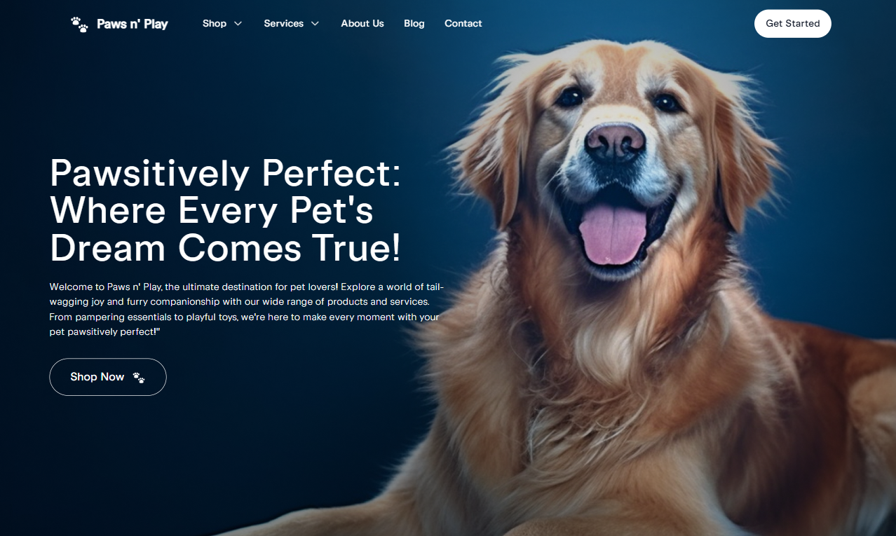

# 🚀 Projeto - Pet Shop Paws n' Play

## 🐾 Sobre o Projeto

A proposta foi criar uma **landing page para o Pet Shop Paws n' Play**, seguindo fielmente o layout utilizado no Figma.

---

## 🛠️ Tecnologias Utilizadas

- **HTML5** — estruturação semântica da página
- **CSS3** — estilização responsiva e moderna
- **JavaScript** — interatividade e comportamentos dinâmicos

---

## 🌱 Organização e Versionamento

O projeto foi organizado com foco em produtividade e escalabilidade, seguindo o fluxo Git:

- `main` → branch de produção
- `dev` → branch de desenvolvimento
- `feat/nome-da-secao` → branches específicas para cada seção da página  
  (ex: `feat/hero`, `feat/shop`, `feat/services`...)

---

## 🙌 Rodando o projeto

Para iniciar o projeto, basta abrir o arquivo `index.html` em seu navegador que a página será renderizada.

## Tamanhos de tela disponíveis

Como base nos tamanhos de tela disponíveis no Figma, o projeto foi desenvolvido para **mobile em 390px** e para **desktop em 1024px e 1440px**.
